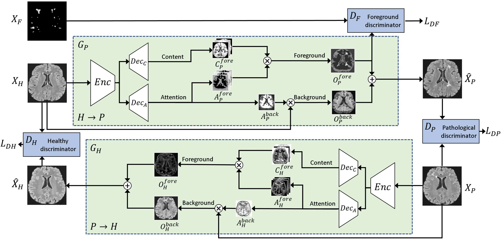
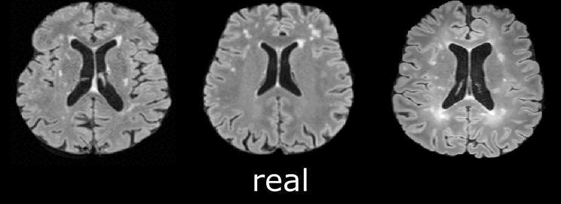

[](https://github.com/dogabasaran/lesion-synthesis/blob/master/LICENSE.md)


[]((https://github.com/dogabasaran/lesion-synthesis/graphs/commit-activity))

# Subject-Specific Lesion Generation and Pseudo-Healthy Synthesis for Multiple Sclerosis Brain Images
*Official repository for the MICCAI 2022 SASHIMI Workshop paper: Subject-Specific Lesion Generation and Pseudo-Healthy Synthesis for Multiple Sclerosis Brain Images* <br> <br>
We propose an attention-based generative adversarial network (GAN) for simultaneous multiple sclerosis (MS) lesion generation and pseudo-healthy synthesis. Our 2D framework employs two generators; one to generate pathological images from healthy images, and a second to synthesize healthy images from pathological ones. We utilise three discriminators, a discriminator for healthy images, a discriminator for pathological images, and a third for the foreground of the pathological generator, which encourages the generator to focus on lesion-related regions. 

## Framework




Subject-specific multiple sclerosis lesion generation   |  Pseudo-healthy synthesis of multiple sclerosis images
:-------------------------:|:-------------------------:
  |  

<p align="center">  
  <b><sub>The changes in ventricular volume are explained in the paper</sub></b><br>
</p>


### [Extended Paper](https://arxiv.org/abs/2208.02135) | [Conference Paper](https://link.springer.com/chapter/10.1007/978-3-031-16980-9_1)

Subject-Specific Lesion Generation and Pseudo-Healthy Synthesis for Multiple Sclerosis Brain Images.<br>
[Berke Doğa Başaran](https://www.imperial.ac.uk/people/berke.basaran19)<sup>1,2</sup>, [Mengyun Qiao](https://scholar.google.com/citations?user=7c4xcv8AAAAJ&hl=zh-CN)<sup>2</sup>, [Paul M Matthews](https://www.imperial.ac.uk/people/p.matthews)<sup>3,4</sup>, [Wenjia Bai](https://www.imperial.ac.uk/people/w.bai)<sup>1,2,3</sup> <br>
<sup>1</sup>Department of Computing, Imperial College London, UK.<br>
<sup>2</sup>Data Science Institute, Imperial College London, UK. <br>
<sup>3</sup>Department of Brain Sciences, Imperial College London, UK. <br>
<sup>4</sup> UK Dementia Research Institute, Imperial College London, London, UK.

The repository offers the official implementation of our paper in PyTorch.

### [License](./LICENSE.md)
<a rel="license" href="http://creativecommons.org/licenses/by-nc-sa/4.0/"></a><br />
Copyright (C) 2022 Imperial College London, UK.

All rights reserved.
Licensed under the [CC BY-NC-SA 4.0](https://creativecommons.org/licenses/by-nc-sa/4.0/legalcode) (**Attribution-NonCommercial-ShareAlike 4.0 International**)

The code is released for academic research use only. For commercial use, please contact [bdb19@ic.ac.uk](bdb19@ic.ac.uk).

## Installation

Clone this repo.
```bash
git clone https://github.com/dogabasaran/lesion-synthesis
cd lesion-synthesis/
```

This code requires PyTorch 0.4.1+ and python 3.6.9+. Please install dependencies by
```bash
pip install -r requirements.txt
```
### MIRTK and FSL Dependencies
By default, the code will not generate lesion masks for the synthetic pathological images. However, if you wish to generate lesion masks for the synthetic pathological images you will need the MIRTK and FSL toolboxes. We use the FSL and MIRTK toolboxes to do brain extraction and registration in order to accurately extract the masks of the synthetic lesions. <br>
See [here](https://fsl.fmrib.ox.ac.uk/fsl/fslwiki/FslInstallation) for FSL installation. <br>
See [here](https://mirtk.github.io/install.html) for MIRTK installation.

In order to generate the lesion masks, pass in the option `--saveMask` during testing (see below).


## Filing structure and data format
Training and testing data should be in the following structure
```
datasets/
 └──dataset_name
      ├── trainA      (training images from domain A - healthy images)
      │   ├── healthy_1.nii.gz
      │   ├── healthy_2.nii.gz
      :   :
      ├──trainB       (training images from domain B - pathological images with lesions)
      │   ├── pathological_1.nii.gz
      │   ├── pathological_1.nii.gz
      :   :
      ├── trainC      (training images from domain C - masked lesion intensity images)
      │   ├── foreground_1.nii.gz
      │   ├── foreground_2.nii.gz
      :   :
      ├── testA     (testing images from domain A - healthy --> pathological)
      │   ├── healthy_test_1.nii.gz
      │   ├── healthy_test_2.nii.gz
      :   :
      └── testB     (testing images from domain B - pathological --> healthy)
          ├── pathological_test_1.nii.gz
          :
          └── pathological_test_2.nii.gz
```
The code is optimised for files in NifTI file format (ending in .nii.gz). Images should be of size (1, 256, 256) in grayscale. If you wish to use 3-channel RGB images you will need to change models/networks.py

NifTI image files do **not** need to be named in a specific format.

In our paper we refer to the three different domains as the "Healthy (H)", "Pathological (P)", and "Foreground (F)" domains. In the code we use "A" for the healthy domain, "B" for the pathological domain, and "C" for the foreground domain. 

## Training/Testing
- Download a dataset
- To view training results and loss plots, run `python3 -m visdom.server` and click the URL [http://localhost:8097](http://localhost:8097).
- To reproduce the results reported in the paper, you would need an NVIDIA GeForce RTX 3080. 
- Train a model:

### Train a New Model
```
python3 train.py --dataroot ./datasets/{dataset_name}/ --name newmodel_name --model agan_foreground -dataset_mode lesion --pool_size 50 --batch_size 1 --niter 100 --niter_decay 100 --gpu_ids 0 --display_id 0 --display_freq 100 --print_freq 100
```

### Test the Trained Model
We have two separate testing scripts, one for the A --> B --> A (Healthy --> Pathological --> Healthy) loop, and the second for the B --> A --> B (Pathological --> Healthy --> Pathological) loop. 

The results will be saved at `./results/`. Use `--results_dir {directory_path_to_save_result}` to specify the results directory. 

Use `--saveMask` to save the lesion masks of the generated pathological images. You will need to add FSL and MIRTK toolbox commands to your PATH.

For A --> B --> A: <br>
You need to have healthy images in the datasets/{dataset_name}/testA/ directory. <br>
This will produce synthetic pathological images in  results/{task_name}/{epoch}/images/fake_B/ directory, and re-created healthy images in results/{task_name}/{epoch}/images/rec_A/. <br>
```
python3 test.py --dataroot ./datasets/{dataset_name}/ --name newmodel_name --model agan_testa --dataset_mode lesion_testa --norm instance --phase test --batch_size 1 --gpu_ids 0 --num_test 5000 --epoch latest
```

For B --> A --> B: <br>
You need to have healthy images in the datasets/{dataset_name}/testB/ directory. <br>
This will produce synthetic pathological images in  results/{task_name}/{epoch}/images/fake_A/ directory, and re-created healthy images in results/{task_name}/{epoch}/images/rec_B/. <br>
```
python3 test.py --dataroot ./datasets/{dataset_name}/ --name newmodel_name --model agan_testb --dataset_mode lesion_testb --norm instance --phase test --batch_size 1 --gpu_ids 0 --num_test 5000 --epoch latest
```


## Citation
If you use this code for your research, please cite our paper.
```
@misc{basaran2022synthlesion,
  doi = {10.48550/ARXIV.2208.02135},
  author = {Basaran, Berke Doga and Qiao, Mengyun and Matthews, Paul M. and Bai, Wenjia},
  title = {Subject-Specific Lesion Generation and Pseudo-Healthy Synthesis for Multiple Sclerosis Brain Images},
  publisher = {arXiv},
  year = {2022}
}
```

## Acknowledgments
This source code is inspired by [CycleGAN](https://github.com/junyanz/pytorch-CycleGAN-and-pix2pix), [GestureGAN](https://github.com/Ha0Tang/GestureGAN), [SelectionGAN](https://github.com/Ha0Tang/SelectionGAN) and [AttentionGAN](https://github.com/Ha0Tang/AttentionGAN). 

## Contributions
If you have any questions/comments/bug reports, feel free to open a github issue or pull a request or e-mail to the author Berke Doga Basaran ([bdb19@ic.ac.uk](bdb19@ic.ac.uk)).

## Collaborations
If you'd like to work together or get in contact with me, please email bdb19@ic.ac.uk.

